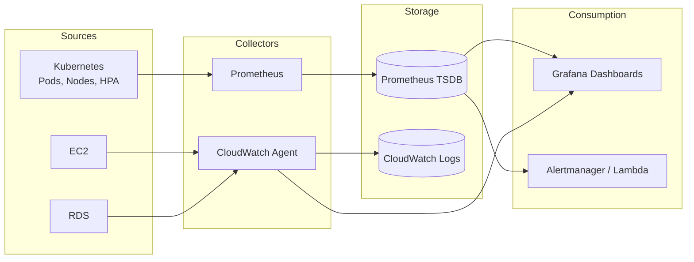

# Project 4 – Monitoring Architecture

Observability, automation, and operational excellence across the full stack from Projects 1–3.

---

## Monitoring Scope

### In-Scope

| Target | Source | Why |
|--------|--------|-----|
| **Flask app pods** | Kubernetes (Project 3) | Application health, restarts, request/error rates |
| **Cluster health** | Kubernetes | Node status, control plane, resource availability |
| **HPA behavior** | Kubernetes | Replica count, scaling events, CPU/memory targets |
| **EC2 instances** | AWS (Project 1) | CPU, memory, disk; `web_01` (Flask), `backend_01` |
| **RDS** | AWS (Project 1) | DB connections, storage, availability |

### Out-of-Scope (for now)

- **S3** – Not critical for runtime observability; add later if used for logs
- **CI/CD pipelines** – Separate concern; GitHub Actions has its own visibility
- **Terraform state** – Infrastructure lifecycle, not runtime monitoring

---

## How This Builds on Projects 1–3

| Project | What Project 4 Uses |
|---------|---------------------|
| **Project 1** (terraform-aws-infra-1025) | EC2, RDS, VPC; AWS account for CloudWatch, backups |
| **Project 2** (dockerized-app-cicd-aws-1125) | Flask app image; optional `/metrics` endpoint |
| **Project 3** (k8s-app-deployment-0126) | k3d cluster, Flask Deployment, Ingress, HPA |

---

## High-Level Data Flow

**Flow summary:**

1. **Sources** – Kubernetes (metrics from kube-state-metrics, metrics-server, app); AWS (EC2, RDS via CloudWatch).
2. **Collectors** – Prometheus scrapes K8s; CloudWatch agent on EC2; RDS metrics via CloudWatch.
3. **Storage** – Prometheus TSDB for K8s metrics; CloudWatch for AWS metrics and logs.
4. **Consumption** – Grafana (dashboards, multiple data sources); Alertmanager or Lambda for alerts.

---

## Log Collection

**Choice:** CloudWatch Logs. Fluent Bit on K8s; CloudWatch agent on EC2.

**Rationale:** AWS-native, simpler than ELK; no self-hosted Elasticsearch. Pay-as-you-go.

---

## Metrics Stack

**Choice:** Prometheus + Grafana in-cluster (k3d).

**Rationale:** Easiest for single-cluster; native K8s discovery. Master locally first; Grafana Cloud remote-write optional later.

---

## Tool Choices (Reference)

| Area | Choice | Notes |
|------|--------|-------|
| Metrics (K8s) | Prometheus + Grafana | In-cluster; scrapes kube-state-metrics, app `/metrics` |
| Metrics (AWS) | CloudWatch | EC2, RDS; optional Grafana data source |
| Logs (K8s) | Fluent Bit → CloudWatch or Loki | DaemonSet; container stdout/stderr |
| Logs (EC2) | CloudWatch Logs agent | Application and system logs |
| Alerting | Prometheus Alertmanager + Lambda | K8s alerts via Alertmanager; AWS via CloudWatch Alarms |
